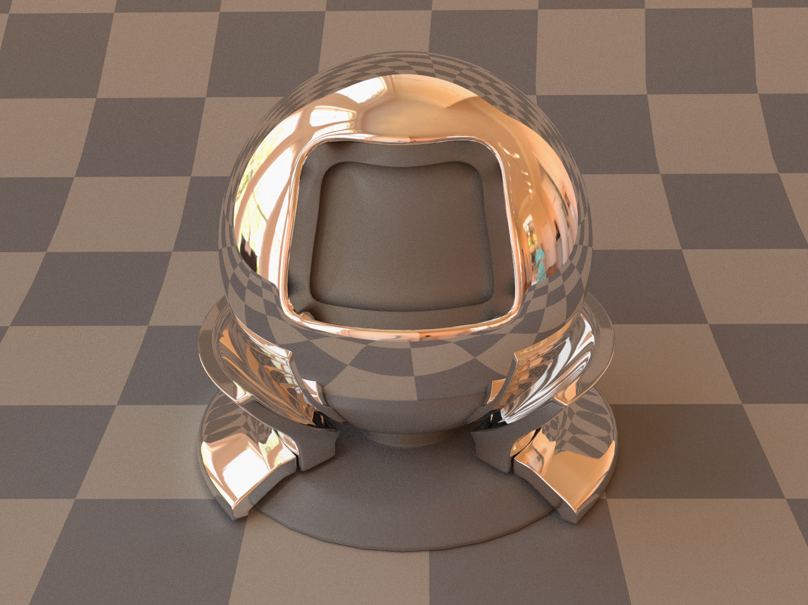
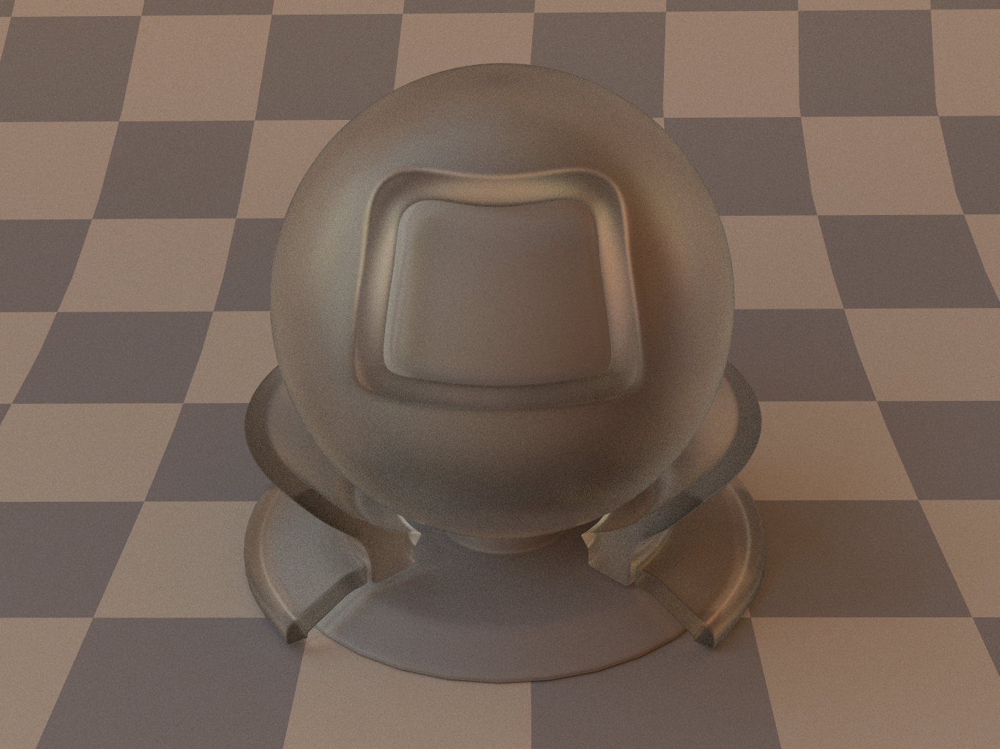
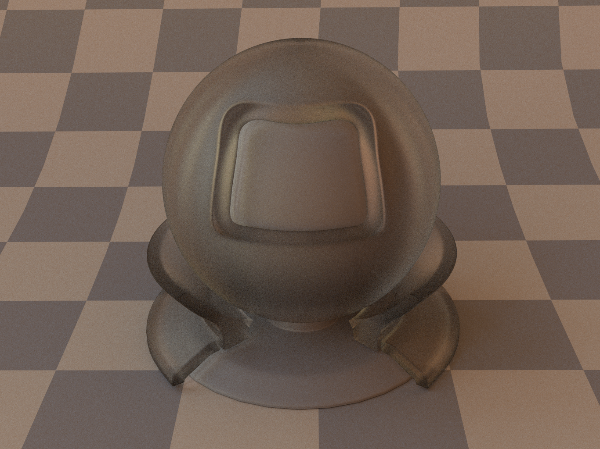
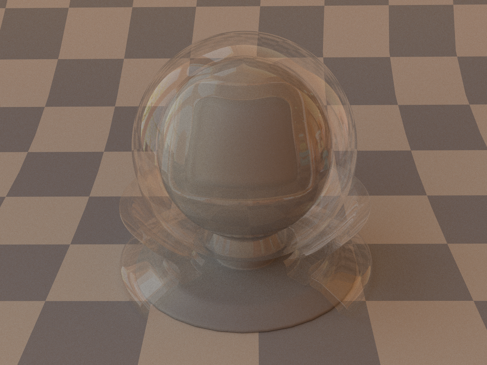
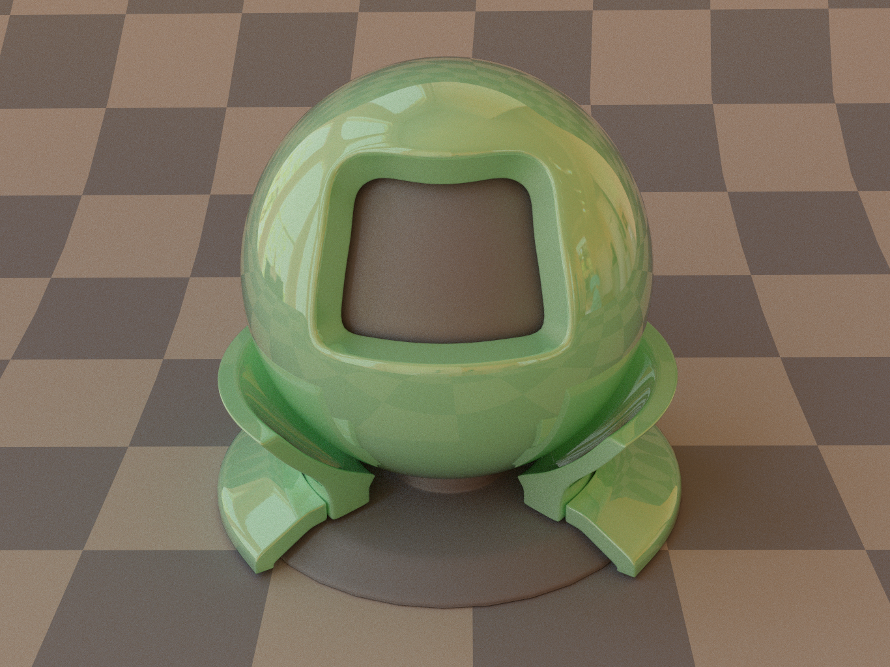
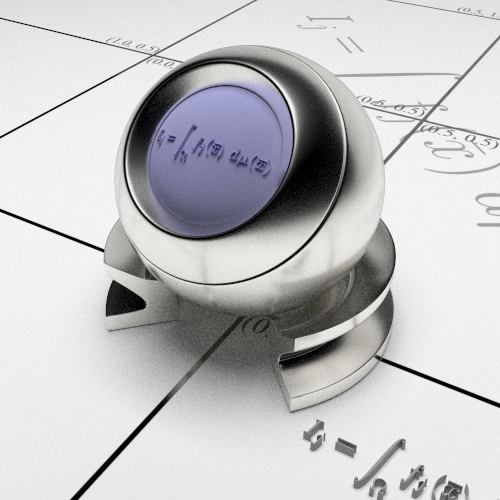
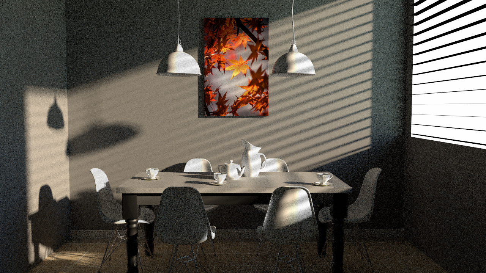

# 蒙特卡洛路径追踪（Monte Carlo Path Tracing）

一个路径追踪小程序，利用了 CPU 多线程或 CUDA 加速计算。项目最初参考了《[GAMES101: 现代计算机图形学入门](https://sites.cs.ucsb.edu/~lingqi/teaching/games101.html)》的作业7，有大幅度的调整。学习笔记保存于[知乎专栏](https://zhuanlan.zhihu.com/p/459580639)。

A RayTracer, accelerated by C++ multithreading or CUDA.

## 1 CPU vs. CUDA

- CPU : AMD Ryzen 7 6800H with Radeon Graphics
- GPU : NVIDIA GeForce RTX 3060 Laptop GPU
- Config : [cornell-box](resources/scene/cornell-box/scene_v0.6.xml)

|     | CPU | CUDA |
| --- | ---        | ---         |
| 耗时 |  1 min 49 sec 330 ms     | 55 sec 58 ms        |
| 绘制结果 |  |  |

## 2 当前项目（Main）实现的功能

### 2.1 积分器（Integrators）

- 基于路径追踪（path tracing）算法迭代求解绘制方程定积分，包括：
  - 使用蒙特卡罗方法（Monte Carlo method）计算辐射亮度（radiance）的数学期望；
  - 重要性抽样（importance sampling），给定光线入射方向和表面法线方向，根据 BSDF 对光线出射方向进行重要性抽样；
  - 多重重要性抽样（multiple importance sampling）：
    - 按发光物体表面积直接采样光源；
    - 按 BSDF 采样光源；
  - 俄罗斯轮盘赌（Russian roulette）控制路径追踪深度；

### 2.2 表面散射模型（Surface Scattering Models）

- 朗伯模型（Lambert's model）定义的[平滑漫反射（smooth diffuse）材质](src/bsdfs/diffuse.cu)；

- Oren–Nayar 反射模型（Oren–Nayar reflectance model）定义的[粗糙漫反射（rough diffuse）材质](src/bsdfs/rough_diffuse.cu)；

- 微表面模型（microfacet model）定义的[电介质（dielectric）材质](src/bsdfs/dielectric.cu)，模仿 [mitsuba 相应的材质](https://mitsuba2.readthedocs.io/en/latest/generated/plugins.html#rough-dielectric-material-roughdielectric)；

- [薄电介质（thin dielectric）材质](src/bsdfs/thin_dielectric.cu)，模仿 [mitsuba 相应的材质](https://mitsuba2.readthedocs.io/en/latest/generated/plugins.html#thin-dielectric-material-thindielectric)；

- 微表面模型（microfacet model）定义的[导体（conductor）材质](src/bsdfs/conductor.cu)，模仿 [mitsuba 相应的材质](https://mitsuba2.readthedocs.io/en/latest/generated/plugins.html#rough-conductor-material-roughconductor)；

- [塑料（plastic）材质](src/bsdfs/plastic.cu)，模仿 [mitsuba 相应的材质](https://mitsuba2.readthedocs.io/en/latest/generated/plugins.html#smooth-plastic-material-plastic)；

### 2.3 其它

- [使用 Kulla 和 Conty 提出的方法](https://fpsunflower.github.io/ckulla/data/s2017_pbs_imageworks_slides_v2.pdf)，尝试补上[微表面模型](https://www.cs.cornell.edu/~srm/publications/EGSR07-btdf.pdf)没有建模的，微表面之间的多重散射；

- 环境映射（environment mapping）

- 凹凸映射（bump mapping）

## 3 历史存档项目（Archived）特有的功能

Following features are available only in [archived project](archive/).

### 3.1 积分器（Integrators）

- [基于双向路径追踪（bidirectional path tracing，BDPT）算法迭代求解绘制方程定积分](archive/src/integrators/bdpt.hpp)；

### 3.2 参与介质（Participating Media）

- [各向同性相函数（Isotropic Phase Function）](archive/src/phase_function/isotropic.hpp)描述的参与介质，模仿 [mitsuba 相应的材质](https://mitsuba2.readthedocs.io/en/latest/generated/plugins.html#isotropic-phase-function-isotropic)；

- [亨尼-格林斯坦相函数（Henyey-Greenstein Phase Function）](archive/src/phase_function/henyey_greenstein.hpp)描述的参与介质，模仿 [mitsuba 相应的材质](https://mitsuba2.readthedocs.io/en/latest/generated/plugins.html#henyey-greenstein-phase-function-hg)；

## 4 Usage and Dependencies

### 4.1 Dependencies

项目使用 [vcpkg](https://github.com/microsoft/vcpkg) 进行 C++ 库管理。

necessary :

- [assimp](https://github.com/assimp/assimp)
- [pugixml](https://pugixml.org/)
- [stb](https://github.com/nothings/stb)
- [tinyexr](https://github.com/syoyo/tinyexr)
- [zlib](https://zlib.net/)

if enable real-time viewer:

- [freeglut](https://freeglut.sourceforge.net/)

### 4.2 CMake Option

- `ENABLE_CUDA` : Specifies whether or not enable GPU-accelerated computing.
  - compile as C++ project and donnot need CUDA SDK if disable.
- `ENABLE_VIEWER` : Specifies whether or not enable real-time viewer.
  - no effect if disable GPU-accelerated computing.

### 4.3 Usage

Command Format: `[--cpu/--gpu/--preview] [--bvh 'bvh type'] [--input 'config path'] [--output 'file path]`

Program Option:

- `--cpu`: use CPU for offline rendering. if not specify specify CPU/CUDA/preview, use CPU.
- `--gpu`: use CUDA for offline rendering, no effect if disbale CUDA when compiling. if not specify specify CPU/CUDA/preview, use CPU.
- `--preview`: use CUDA for real-time rendering, no effect if disbale CUDA when compiling. if not specify specify CPU/CUDA/preview, use CPU.
- `--bvh`: bvh type for ray tracing, available: [linear, normal], default: 'linear'.
- `--input`: read config from mitsuba format xml file, load default config if empty, default: empty.
- `--output`: output path for rendering result, only PNG format, default: 'result.png'.
  - press 's' key to save when real-time previewing.

## 5 References

- [Mitsuba renderer](https://github.com/mitsuba-renderer/mitsuba)
- 《[GAMES101: 现代计算机图形学入门](https://sites.cs.ucsb.edu/~lingqi/teaching/games101.html)》
- 《[GAMES202: 高质量实时渲染](https://sites.cs.ucsb.edu/~lingqi/teaching/games202.html)》
- 《[Accelerated Ray Tracing in One Weekend in CUDA](https://developer.nvidia.com/blog/accelerated-ray-tracing-cuda)》

## 6 Gallery

Results from ['develop' branch](https://github.com/zhiwei-c/Monte-Carlo-Path-Tracing/tree/develop).

- conductor
  
- rough conductor, without energy compensation
  
- isotropic rough conductor, without energy compensation
  
- dielectric
  
- rough dielectric, without energy compensation
  
- isotropic rough dielectric, without energy compensation
  
- thin dielectric
  
- plastic
  
- rough plastic
  
- lte-orb, rough glass, without energy compensation
  
- lte-orb, silver, without energy compensation
  
- dragon
  
- classroom
  
- dining room
  